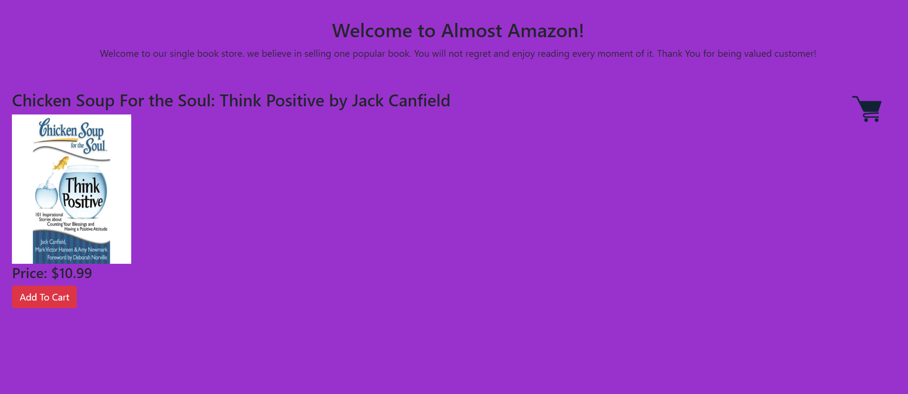
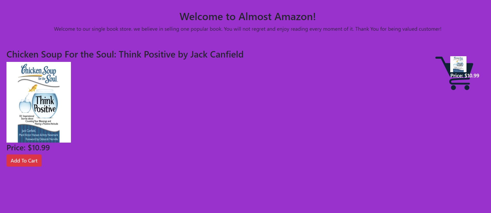

# Almost-Amazon
This project is an exploration of ES6 modules utilizing import and export. I built a modular version of the greatest book store known to humankind - Almost Amazon. This bookstore has a single book. When you click on add to cart, the book will diaplay in a cart and will be ready to checkout.


## Screenshots
1. Home Page


2. Book added to Cart Page



## How to run this project
* Use npm to install http-server in your terminal:
```
npm install -g http-server
```
* Run the server
```
hs -p 9999
```
* Open chrome and navigate to :
```
localhost:9999
```
